前提：中国大陆用户请注意，满足手机装有google play并且可访问google官网（翻墙）后才能接入google广告，不然会一直提示网络错误。

## 一 接入可玩广告SDK和AdMob SDK
以Android Studio为例，其它平台请查看可玩广告接入文档，AdMob SDK接入文档，以下简要步骤
### 1. 添加可玩广告SDK依赖：
在app Module下添加
```
dependencies {
compile 'com.playableads:playableads:2.0.2'
}
```
### 2. 添加AdMob广告SDK依赖
a. 在project构建文件(gradle)中的allprojects.repositories结点添加以下代码
```
maven {
url "https://maven.google.com"
}
```
使其看起来像：
```
allprojects {
repositories {     
maven {
url "https://maven.google.com"
}
}
}
```
b. 在app Module下添加
```
dependencies {
compile 'com.google.android.gms:play-services-ads:11.6.2'
}
```
## 二 在AdMob平台添加可玩广告广告源
### 1: 新应用，添加广告位，使其运行可玩广告
a. 添加应用，如图：
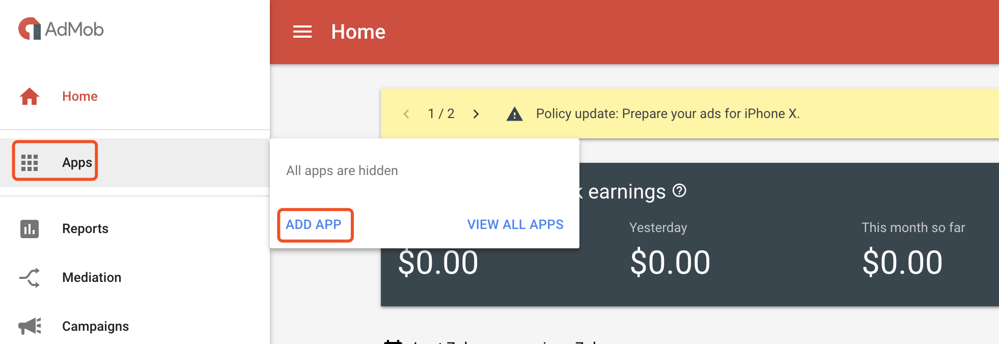
b. 选择应该是否已经上架到google play或app store，根据实际情况选择即可。这里选择“NO”, 后期上线后可再回来绑定
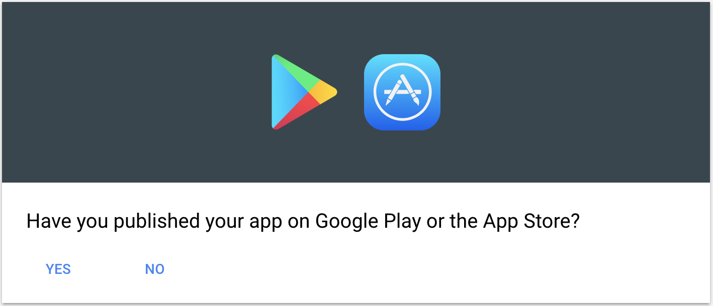
c. 设置应用名以及平台，以PlayableAdMobDemo应用及Android平台为例，填好后点击“ADD”继续。
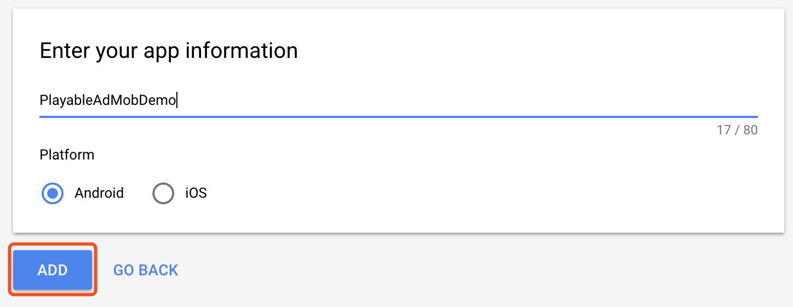
d. 创建完成，此时已经拥有应用ID，点击“NEXT: CREATE AD UNIT”创建广告位。
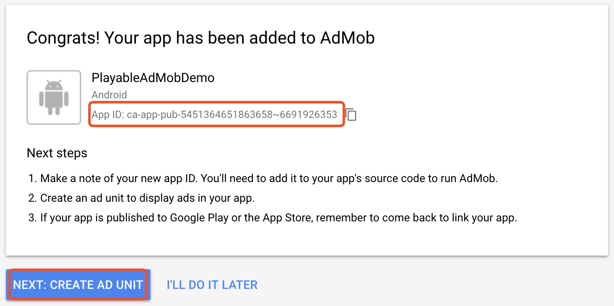
e. 创建广告位时，请务必选择“激励视频”样式，如下框住的按钮
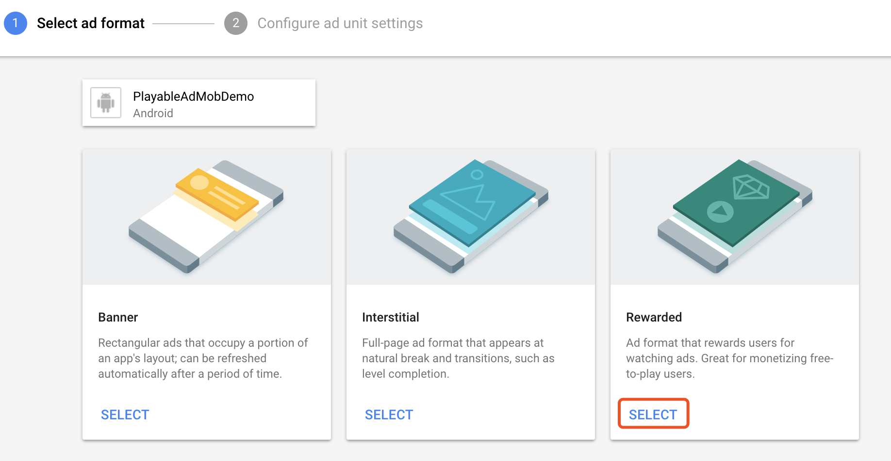
f. 根据需求填写广告位信息，如这里只是示例，只填写了广告位名称，其它为默认。点击“CREATE AD UNIT”创建完成
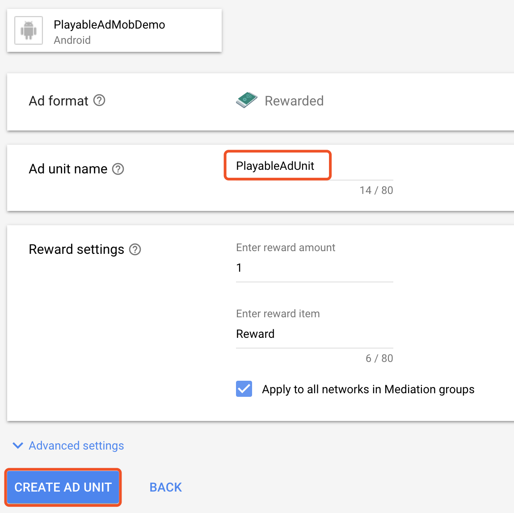
g. 创建完成，记录下新创建的应用ID和广告位ID以备后用。

### 2 添加可玩广告源
a. 在Mediation目录下点击“CREATE MEDIATION GROUP”
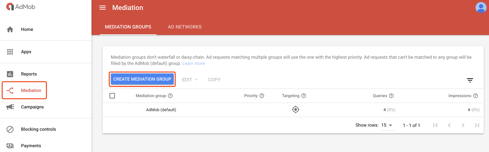
b. 设置广告源信息，请根据图示设置。Ad format为Rewarded video，Platform设置为Android，点击“CONTINUE”
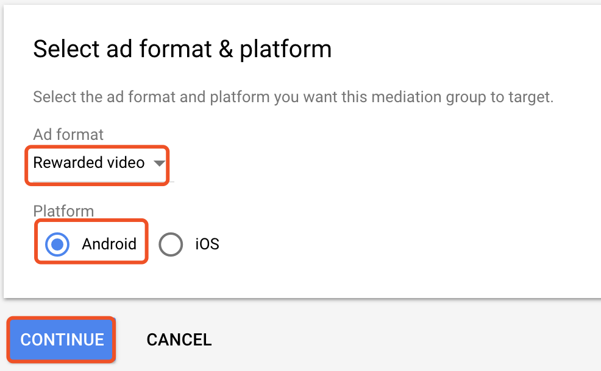
c. 设置广告源方便管理，这里设置为Playable-Advertising-android（可以自行设置其它名称），点击"ADD AD UNITS"向该源添加广告位
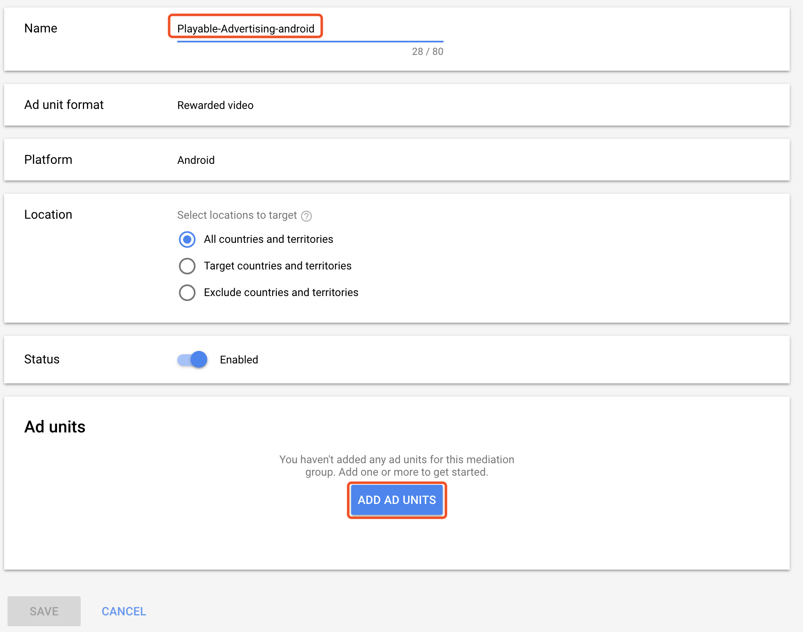
d. 选择步骤2中创建的广告位，点击“DONE”完成添加
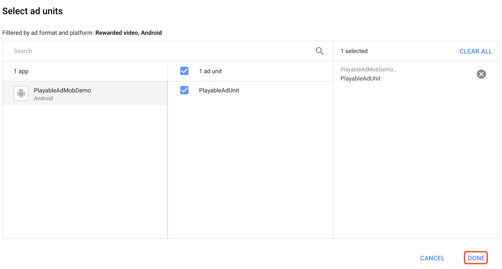
c. 添加适配类信息，以便传递可玩广告所需的信息
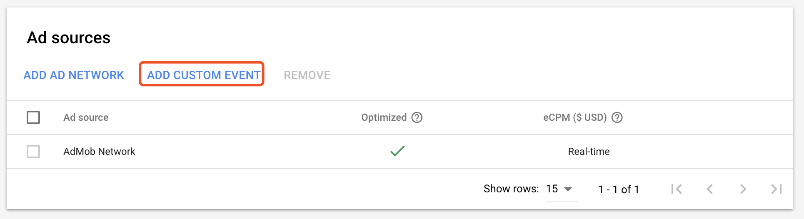
d. 添加广告源标签名和eCPM值，eCPM值请关注可玩官方网站，根据实际添加并更新。
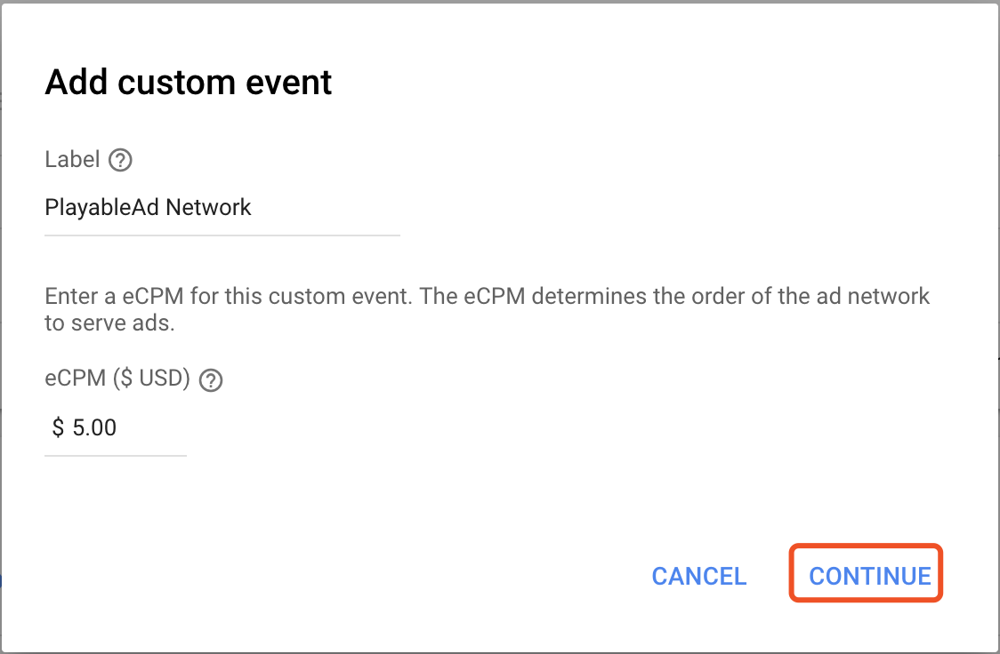
e. 添加适配类以及可玩广告应用ID（如androidDemoApp）和广告位ID（如androidDemoAdUnit），适配类在目录三中介绍。
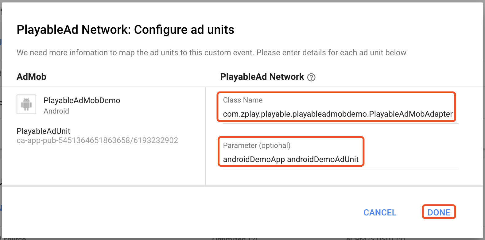
f. 配置完成，可看到图示1位置的广告位id已经支持图示2中的两个广告源，点击“SAVE”保存退出
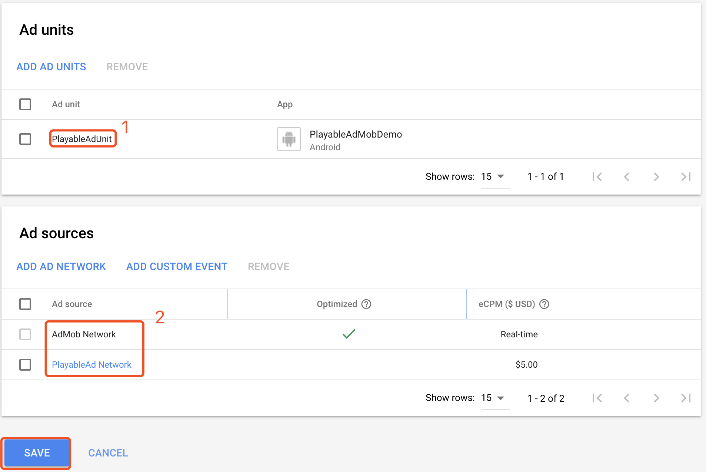
### 3 已有应用，修改现有广告位，使其支持可玩广告
a. 注意此处，OldRewardedUnit广告位默认有0个三方广告源。

b. 进入可玩广告源

c. 点击“ADD AD UNITS”将广告位添加可玩广告源
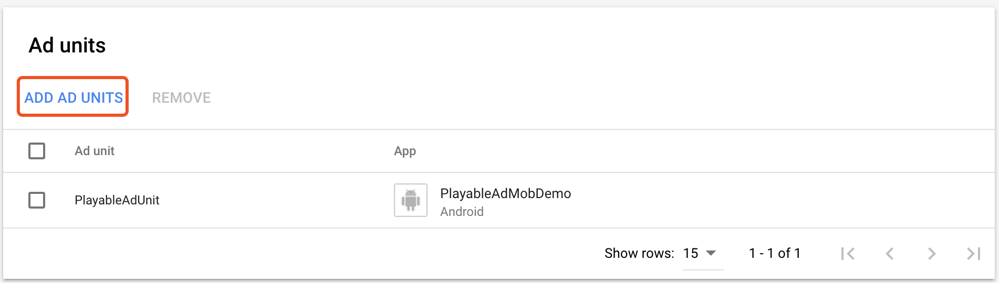
d. 选择已有的激励视频广告位，点击“CONTINUE”，进行适配类设置
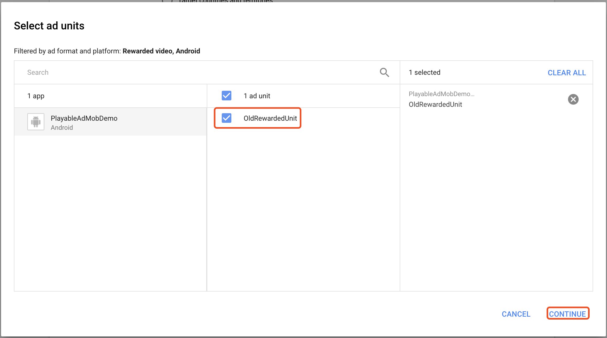
e. 设置适配类，根据实际情况进行填写，点击“DONE”完成配制。
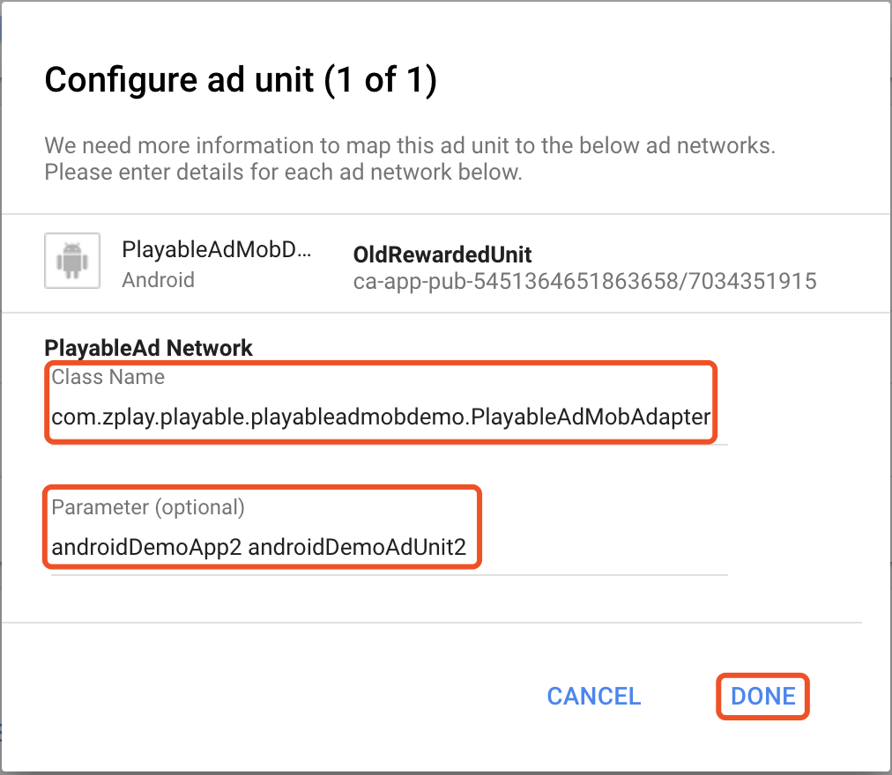
f. 保存
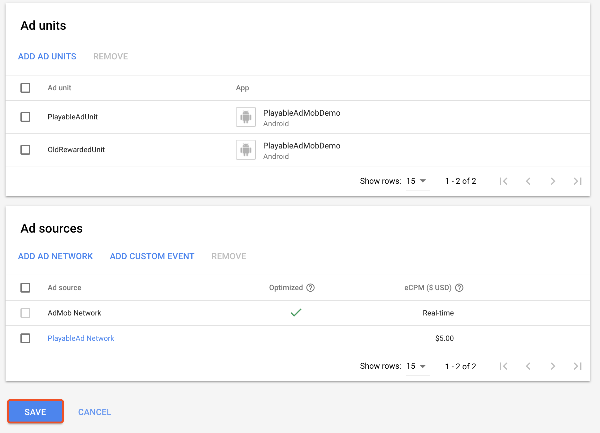
g. 此时，OldRewardedUnit的三方广告源为1了
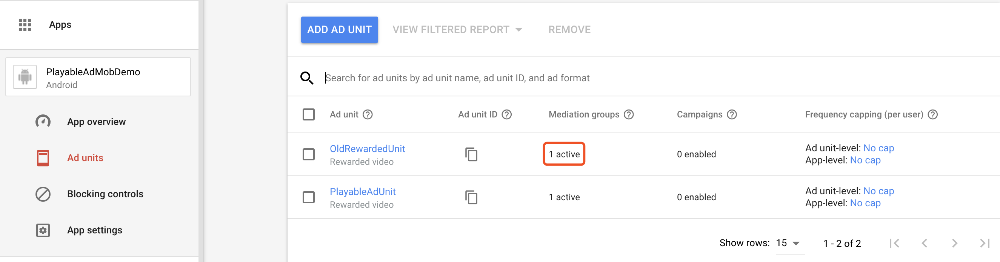
## 三 适配类与请求请参考DEMO
